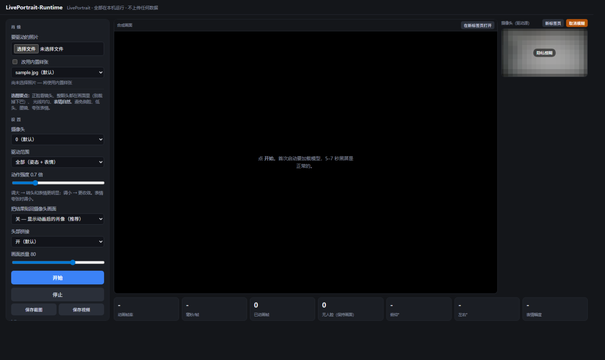
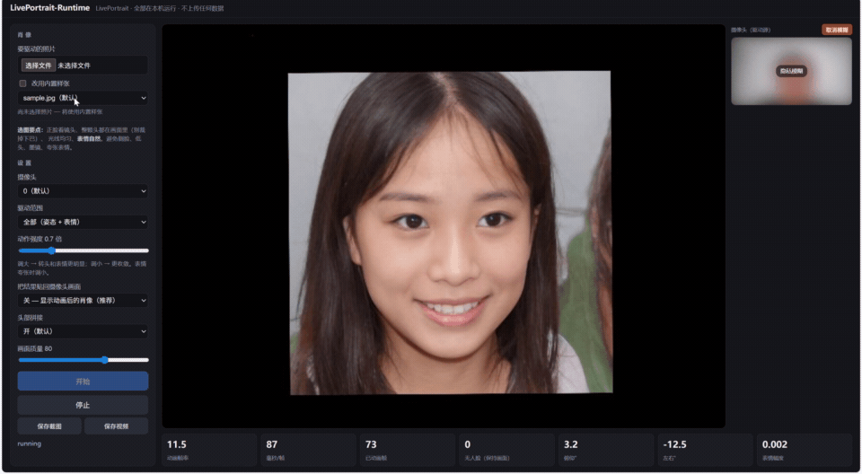
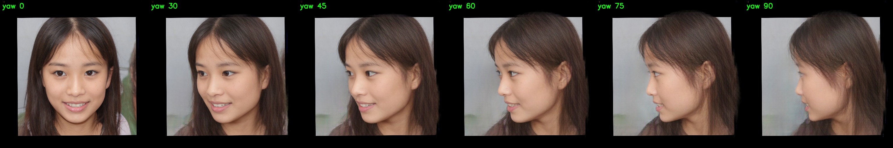

# Runtime-LivePortrait

**把 [LivePortrait](https://github.com/KwaiVGI/LivePortrait) 变成一套 Windows 上开箱可用的实时运行时** ——
中文网页界面、摄像头实时驱动、隐私保护、显卡自动适配、诊断工具。

> ## ⚠️ 非官方 · 仅限非商业用途
>
> - 本项目是**第三方封装**，**不是** LivePortrait 官方项目。
> - 依赖的 **InsightFace 人脸模型仅限非商业研究使用**，因此
>   **本项目整体不能用于商业用途**（即使代码是 MIT）。
>   详见 **[THIRD_PARTY_LICENSES.md](THIRD_PARTY_LICENSES.md)**。
> - 请勿用于未经同意的换脸、冒充或任何违法用途。

---





> 录屏演示中，摄像头小窗开启了隐私保护（右侧区域**看不到任何可辨认的面部特征**）。
> 当前的遮罩比演示里更强，升级为不可逆马赛克，见下方「隐私保护」。

---

## 它做了什么

LivePortrait 官方提供的是**研究代码**：吃文件、吐文件、每次重算源图。
本项目把它做成能**实时用起来**的东西，并且把几件容易被忽略的事补上了：

| 工作 | 说明 |
|---|---|
| **实时管线** | 拆成「每张源图一次」+「每帧」两段路径，避免每帧重算源图外观特征 |
| **中文网页 UI** | 纯标准库 `http.server`，**零额外 Web 依赖**（不会拖进第二个 numpy）|
| **摄像头实时驱动** | 页面一打开就有摄像头预览，方便先把脸摆正 |
| **多窗口观看** | 合成画面和摄像头各自可**在新标签页全屏打开** |
| **隐私遮罩** | 摄像头小窗可一键遮罩，**不可逆马赛克**（详见下方）|
| **关闭即清理** | 关掉程序时自动删除上传的照片和临时帧 |
| **显卡自动适配** | 按 compute capability 自动选 CUDA 栈，**RTX 20 ~ 50 系都能跑** |
| **诊断工具** | 环境自检、逐阶段测速、角度渲染、跨进程桥接 |

## 实测性能

| 指标 | 本机（i7-13700HX + RTX 4080 Laptop 12 GB）|
|---|---|
| 引擎 | **约 12 帧/秒**（约 82 ms/帧；空闲时可到 15 帧）|
| 显存 | 约 1.3 GB |
| 首次启动 | 8~9 秒（加载模型）|
| 之后每次启动 | **约 2 秒**（模型常驻复用）|

> **瓶颈是模型本身**，不是配置问题：SPADE 解码器约 33 ms、warping 约 17 ms。
> 这是**算力敏感型**任务，帧率大致随 GPU 算力线性变化 —— 换更弱的显卡会更慢，
> 这是预期行为而**不是 bug**。
>
> 已实测排除的提速路径（ONNX / TensorRT / fp16 / 降分辨率）见
> [docs/PERFORMANCE.md](docs/PERFORMANCE.md)。
>
> 觉得帧率异常低时，双击 **`测速.bat`**（或跑 `tools/speed_probe.py`），
> 它会分项报告 GPU 频率、onnxruntime 是否掉回 CPU、逐阶段耗时。

---

## 快速开始

### 1. 环境要求

- **Windows x64**（代码里有 Windows 专用的控制台处理）
- **NVIDIA 显卡，显存 ≥ 6 GB**（RTX 20 系 ~ RTX 50 系，自动适配）
- **不需要安装 CUDA Toolkit** —— torch 的 wheel 自带 CUDA 运行库
- **不需要预装 Python** —— 没有的话安装脚本会替你装一份（per-user，不用管理员）
- 磁盘约 **10 GB**（项目 47 MB + 权重 667 MB + 依赖 + `.venv`）

### 2. 一键安装

**双击 `一键安装.bat`**（或先双击 `环境自检.bat` 看状态）。

它会依次：

| 步骤 | 做什么 |
|---|---|
| 0 | **读显卡的 compute capability，决定用 cu118 还是 cu128**（见下方「显卡适配」）|
| 1 | 找 Python 3.10；没有就用**华为/清华镜像**下载安装器并静默安装（per-user）|
| 2 | 在本项目里创建虚拟环境 `.venv`（**不动系统里其他 Python**）|
| 3 | 下载**对应那套**依赖 wheel 到 `.venv-wheels\<栈名>\`（**只下一次**）|
| 4 | 从本地 wheel 安装，**之后不再联网** |
| 5 | 下载模型权重到 `LivePortrait/pretrained_weights`（约 667 MB）|
| 6 | 校验并打印 torch / CUDA / numpy / opencv / onnxruntime 状态 |

整个过程**不需要管理员权限**，也**不往系统里装任何东西**（除了那份 per-user 的 Python）。

想手动分步做也可以：

```powershell
# 看你的显卡该用哪套 CUDA
python tools\gpu_choice.py

# 只下载依赖 wheel（用任意 Python 3.10 执行）
python tools\fetch_wheels.py                # 国内镜像，自动按显卡选栈
python tools\fetch_wheels.py --source pypi  # 官方 PyPI
python tools\fetch_wheels.py --check        # 只看已下载情况
python tools\fetch_wheels.py --cuda cu128   # 强制某一套

# 只跑安装流程
powershell -ExecutionPolicy Bypass -File tools\setup.ps1
```

### 3. 显卡适配（RTX 20 ~ 50 系）

**不同代的 N 卡需要的 CUDA 版本不一样**，所以项目带**两套依赖清单**，
安装时自动按显卡选：

| 栈 | torch | CUDA | onnxruntime | 覆盖 |
|---|---|---|---|---|
| **cu118** | 2.1.0+cu118 | 11.8 | 1.18.0 | sm_50 ~ sm_90 |
| **cu128** | 2.7.0+cu128 | 12.8 | 1.22.0 | sm_50 ~ **sm_120** |

| 你的显卡 | 用哪套 | 为什么 |
|---|---|---|
| RTX 20 系 (sm_75) / 30 系 (sm_86) / **40 系 (sm_89)** | **cu118** | 原生 cubin，最快 |
| **RTX 50 系 (sm_120)** | **cu128** | **CUDA 11.8 物理上无法编译 sm_120，cu118 完全跑不了** |

**如果装错了会怎样：**

- RTX 50 用 cu118 → 报
  `CUDA capability sm_120 is not compatible with the current PyTorch installation`
- RTX 40 用 cu128 → 能跑，但 cu128 没有 sm_89 的 cubin，会退到 sm_86，
  **实测慢约 12%**（82.5 ms → 92.4 ms/帧）

所以规则是 **sm_89 及以下走 cu118，sm_90 及以上走 cu128**。
判断只有一份，在 `tools/gpu_choice.py`，安装脚本和下载脚本共用。

重装成正确的栈：

```powershell
$env:LPR_CUDA='cu128'    # 或 cu118
powershell -ExecutionPolicy Bypass -File tools\setup.ps1 -Reinstall
```

> **另一个坑**：`onnxruntime-gpu` 的版本必须跟着 CUDA 栈走。
> 1.18 是按 CUDA 11.8 + cuDNN 8 编译的，遇到 cu128 的 CUDA 12.8 + cuDNN 9 会报
> `CUDA_PATH is set but CUDA wasnt able to be loaded`。所以 cu128 那套配 1.22。

### 4. 模型权重

权重**不在本仓库里** —— 667 MB，而且 **InsightFace 部分仅限非商业研究**，
不是能随便分发的（详见 [THIRD_PARTY_LICENSES.md](THIRD_PARTY_LICENSES.md)）。

一键安装会**自动下载**。想单独下：

```powershell
.venv\Scripts\python.exe tools\download_weights.py

# 国内网络走镜像
.venv\Scripts\python.exe tools\download_weights.py --mirror
```

**逐个文件校验 SHA-256**，中断或损坏会重新下载。

### 5. 启动

```powershell
.venv\Scripts\python.exe tools\check_env.py   # 应全部 [ OK ]
Start_WebUI.bat
```

### 6. 使用

1. 浏览器打开后，右上角就有**实时摄像头预览** —— 先把脸摆进画面
2. 左侧点**选择文件**挑一张正脸照片（也可以直接用内置样张）
3. 点**开始**，等 1~2 秒出画面
4. 可以点**保存截图** / **保存视频**（存到 `output/`）
5. 「合成画面」和「摄像头」各有按钮，可**在新标签页全屏观看**

**全部在本机运行，不上传任何数据。**

---

## 隐私保护

这个项目默认假设你**不想让摄像头里的自己被看到**。

| 功能 | 说明 |
|---|---|
| **摄像头遮罩** | 右上角「隐私模糊」按钮。遮罩是**不可逆**的：画面被缩到极小块再放大，**面部结构物理上不可能存活**（不是高斯模糊 —— 模糊是可逆卷积，理论上能反推）|
| **`?mask=1` 参数** | 打开 `http://127.0.0.1:7860/?mask=1` **强制开遮罩**，不受上次记住的设置影响。**录屏、截图、直播时用这个** |
| **关闭即清理** | 关掉控制台窗口时，自动删除上传的底图和临时帧 |

**为什么只遮摄像头、不遮合成画面：**

- 摄像头小窗是**唯一出现真实人物**的地方 —— 那是坐在电脑前的你
- 合成画面显示的是**你选的那张底图**被驱动后的结果，不是摄像头画面

> 遮罩**只影响网页显示**，**不影响识别与推理**（模型拿到的仍是原始帧）。

---

## 底图怎么选（直接决定效果）

| 要点 | 原因 |
|---|---|
| **正脸看镜头** | 侧脸底图会让驱动一直偏着 |
| **表情中性** | 源图表情会被外观特征编码，**关键点修正去不掉** |
| **整颗头在画面里** | 别裁掉下巴或头顶 |
| 光线均匀 | 侧光会在结果里留下硬阴影 |

内置 `sample.jpg` / `sample2.jpg` 是**合成的写实人脸，不是真人**；
`sample3.PNG` 是 AI 生成的插画（非真人）。

---

## 关于「转头」

**LivePortrait 本身就能很好地转大角度头。** 下面这组图是把**上游自己的
`transform_keypoint` 一字未改**地调用、只替换 yaw 得到的：



**yaw 0 / 30 / 45 / 60 / 75 / 90 —— 90° 仍是干净的侧脸。**

开发过程中我曾错误地断言"形变框架做不到大角度转头"，
**那其实是我代码的 bug**（算了旋转矩阵却没用）。完整记录见
[docs/CORRECTION_HEAD_TURN.md](docs/CORRECTION_HEAD_TURN.md) —— 留着当反面教材。

**真实的限制**是另一条：**源图自带的表情去不掉**，所以底图请用中性表情。

---

## 目录结构

```
Runtime-LivePortrait/
  Start_WebUI.bat              入口，双击启动
  app.py                       网页服务 + 会话/摄像头生命周期 + 隐私清理
  fastportrait/
    realtime.py                实时推理运行时（核心）
    session.py                 会话层
    __init__.py                CUDA DLL PATH 修复
    grid_sample_3d.py          ONNX 可导出的三线性采样器（实验，未启用）
  tools/
    setup.ps1                  一键安装（选栈 → 找/装 Python → 建 venv → 装依赖 → 下权重）
    gpu_choice.py              按 compute capability 选 cu118 / cu128（唯一判断来源）
    fetch_wheels.py            下载对应那套依赖 wheel 到 .venv-wheels\<栈名>\
    requirements-common.txt    与显卡无关的依赖
    requirements-cu118.txt     CUDA 11.8 栈（sm_75 ~ sm_89）
    requirements-cu128.txt     CUDA 12.8 栈（sm_90 及以上，RTX 50 必需）
    download_weights.py        下载并校验权重
    check_env.py               环境自检（会指出栈选错了）
    speed_probe.py             逐阶段测速，定位瓶颈
    render_angles.py           渲染不同转角（转头能力证据）
    run_webcam.py / run_video.py / pick_and_run.py
    frame_client.py / frame_worker.py   跨进程桥接
    build_portable.py          生成零安装便携版
  portraits/                   底图（含 3 张内置样张）
  docs/                        部署、性能、ONNX 实验、更正记录
  LivePortrait/                上游代码（MIT），权重需自行下载
```

**仓库里没有**（都由脚本按需下载，见上方安装步骤）：

| 不包含 | 原因 |
|---|---|
| 模型权重（667 MB）| 体积大，且 **InsightFace 部分仅限非商业**，不是能分发的 |
| 依赖 wheel（几 GB）| 第三方二进制，让 `pip` 从官方源取更合规也更小 |
| Python 安装器 | 让用户从 python.org（或国内镜像）获取原件 |
| `.venv/` | 本地环境，不该进版本库 |

`download_weights.py` 与 `fetch_wheels.py` 都**直接指向上游官方地址**
（Hugging Face / PyPI / PyTorch 官方索引），**转手环节为零**。

`git clone` 下来只有 **约 47 MB**（不含权重与依赖）。

---

## 便携版（可选）

给**不能装任何东西**的场景（别人的电脑、公用机、U 盘）：

```powershell
python tools\build_portable.py --from-runtime <某个可用的 python 环境> --out D:\Portable
```

产出一个**自包含文件夹**：内含完整运行时 + 项目 + 权重 + `启动-便携版.bat`。

- **零安装**：不写注册表、不改 PATH、不动系统 Python
- **可搬走**：整个文件夹拷到任何位置（含 U 盘）都能用，全相对路径
- **卸载**：删文件夹即可
- 注意：**运行时必须是完整目录副本，不能是 venv** ——
  venv 的 `pyvenv.cfg` 会记下创建它的绝对路径，换台电脑就会报
  `No Python at '<原路径>'`。构建脚本有校验，会直接拒绝打包 venv。

---

## 许可

| 部分 | 许可 |
|---|---|
| 本项目自己的代码（`app.py`、`fastportrait/`、`tools/`）| **MIT** |
| `LivePortrait/` 上游代码 | MIT（© 2024 Kuaishou）|
| **InsightFace `buffalo_l` 模型** | ❌ **仅非商业研究** |
| 内置样张 `sample.jpg` / `sample2.jpg`（StyleGAN2-ADA 生成）| ⚠️ NVIDIA 非商业许可 |
| 内置样张 `sample3.PNG`（AI 生成插画）| 使用者自备，随仓库分发 |

**结论：整个项目不能商用。** 细节与商用替代方案见
**[THIRD_PARTY_LICENSES.md](THIRD_PARTY_LICENSES.md)**。

## 致谢

- [LivePortrait](https://github.com/KwaiVGI/LivePortrait) — KwaiVGI / Kuaishou（MIT）
- [InsightFace](https://github.com/deepinsight/insightface) — buffalo_l 模型
- 本项目由 **LRYRYL（闰聿）** 开发

## 免责声明

本项目按"现状"提供，不附带任何担保。使用者需自行确保
**有权使用所涉及的人脸**，并遵守当地关于深度合成与肖像权的法律法规。
作者不对使用者的行为及其后果负责。
