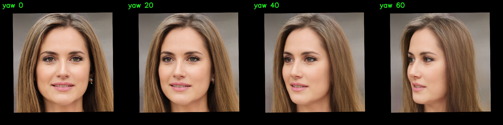

# 重要更正：转头问题是我代码的 bug，不是原理限制

**我之前的结论是错的。** 我在多处写过"大幅转头在形变框架内无解"、
"形变只能搬像素不能造像素"。**这个说法对转头这件事不成立。**

## 实测证据

### 决定性证据：**上游代码原样**就能扛到 90°

下面这组图是把**上游 LivePortrait 自己的 `transform_keypoint` 一字未改**地调用，
只替换 pitch/yaw/roll 后解码得到的：


**yaw 0 / 30 / 45 / 60 / 75 / 90 —— 90° 仍是干净的侧脸**，无失真、无塌陷。

**这直接证伪了我原来的说法**：既然上游原样就能转 90°，
那"形变框架做不到大角度转头"就是错的，问题 100% 在我的调用代码里。

### 修正后的代码



yaw 0 / 20 / 40 / 60 —— 同样干净。pitch 0 / 15 / 30 / 45 也干净（低头、抬头都不崩）。

**LivePortrait 的形变本来就能很好地转 3D 头。** 它用的是隐式 3D 关键点 + 3D 特征体，
转动是它的核心能力。

> 这一条对项目定位很重要：**模型本身已经足够强**，
> 本项目的价值不在"让它能转头"，而在把它做成**可实时运行的运行时**
> （拆出每帧路径、修 bug、独立采集线程、隐私清理、诊断工具）。
> 这也是项目命名为 **Runtime-LivePortrait** 的原因。

## 真正的 bug

`fastportrait/realtime.py` 的 `process()` 里，我**算出了驱动者的旋转矩阵 `R_new`，
然后从来没有使用它**：

```python
# 旧代码（错）
R_new = (R_d_i @ self.R_d_0.permute(0,2,1)) @ self.R_s   # 算出来了
delta_new = self.x_s_info["exp"] + (...)                  # 只用了表情差
x_d_i_new = self.x_s + delta_new                          # ← R_new 被丢掉了
```

**为什么看起来"像在动但没转头"**：`self.x_s` 已经过 `transform_keypoint()`，
即 `scale * (kp @ R_s + exp_s) + t_s`。往它上面加表情增量，**只能动嘴和眼睛**，
姿态永远进不去。

**量化**：
| | yaw 变化 40° 时输出平均像素差 |
|---|---|
| 旧代码 | **0.95 / 255**（几乎没变） |
| 更正后（强度 0.7）| **13.38 / 255** |
| 更正后（强度 1.0）| **16.27 / 255** |

## 修法

按 `transform_keypoint` 的同一套公式重建驱动关键点，但用**驱动者的**旋转和表情：

```python
# Eqn.2:  s * (R * x_c + exp) + t
kp_new = kp_src @ R_new + exp_drv.view(kp_src.shape)
kp_new = kp_new * self.x_s_info["scale"][..., None]
kp_new[:, :, 0:2] += self.x_s_info["t"][:, None, 0:2]
x_d_i_new = kp_new
```

## 顺带查清的一件事

`headpose_pred_to_degree()` 是**恒等函数** —— 它不改数值。
所以 `pitch`/`yaw`/`roll` 拿到的**本身就是角度**（示例图 pitch=16.1°、yaw=3.6°），
不是"分箱类别索引"。

**我第一次验证时按弧度传参**，结果旋转量约为 0，又得出一次"转不动"的错误结论。
**这是我在这个项目上第三次因为搞错单位/约定而得出错误结论。**

## 端到端结果

(端到端样张已随中间产物清理)

左：摄像头（驱动者低头、闭眼）　右：合成结果（**同样低头、闭眼**）

**姿态确实传递了。**

## 目标 D 的结论

**不需要做了。** 目标 D（预生成多角度视图喂给形变引擎）是在
"形变转不了头"这个**错误前提**下提出的。既然形变本身能转到 60°，
就没必要预生成视图。

## 还剩下什么真实的限制

转头这件事上**没有**我原先说的限制。仍然真实存在的限制是：

- **源图本身的表情会被保留**（`f_s` 外观特征提取自源图的当前表情）——
  这一条我实测过，无法通过关键点修正去掉，需要换一张中性表情的底图
- **极端角度（>60°）仍会退化**，但这是模型对遮挡区域的外推，
  比"完全不能转"要轻得多

## 我的错误模式（值得记录）

这个项目里我三次得出错误结论，都是**同一个原因**：
**在验证不足时就下结论，并把结论写进文档当成事实。**

1. "z 轴不可解释" —— 实际是 D=2 标定的混叠
2. "真三线性采样" —— 实际是探针读错了输出位置
3. "转头在形变框架内无解" —— 实际是我没把 `R_new` 用上

**共同点**：都不是能力不足，而是**我把"我测得的结果"当成了"系统的极限"**，
而没有先确认我的测量/实现本身是对的。
